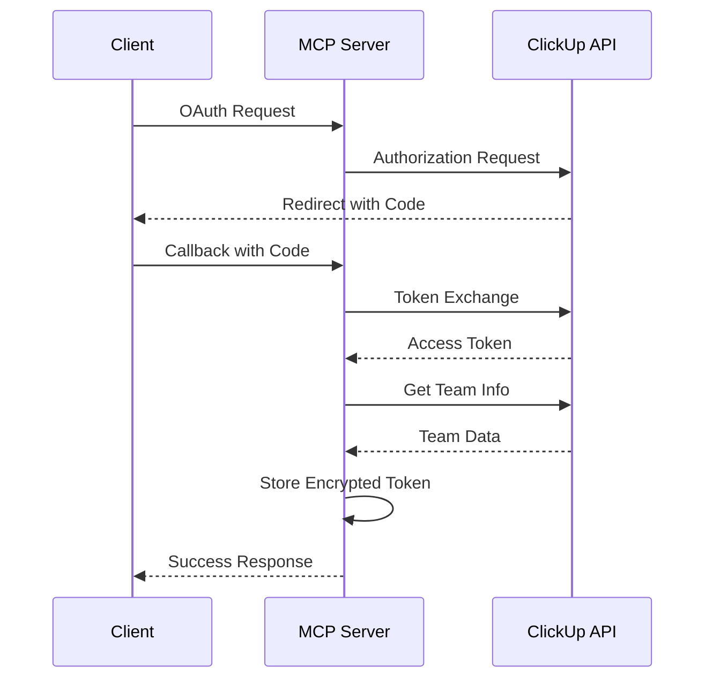

# ClickUp MCP Server - Technical Documentation

## Architecture Overview

The ClickUp MCP Server is built as a modular Node.js application using TypeScript, designed to provide a secure and efficient bridge between ClickUp's API and the MCP ecosystem.

### Core Components

#### 1. OAuth Service (`oauth.service.ts`)

- Handles OAuth 2.0 authentication flow with ClickUp
- Manages secure token storage using AES-256-GCM encryption
- Implements state validation for CSRF protection
- Handles team management and token-to-team mapping
- Token lifecycle management with automatic expiration

#### 2. ClickUp Service (`clickup.service.ts`)

- Manages API interactions with ClickUp
- Implements rate limiting and request throttling
- Handles API error responses and retries
- Provides high-level methods for ClickUp operations

#### 3. Server (`server.ts`)

- Express.js based HTTP server
- Route management and middleware configuration
- Health check endpoints
- Static file serving
- Error handling middleware

### Security Implementation

#### Authentication Flow

1. **OAuth Initiation**

   ```typescript
   generateAuthUrl(): { url: string; state: string }
   ```

   - Generates a cryptographically secure state token
   - Creates ClickUp authorization URL with required parameters

2. **Callback Handling**

   ```typescript
   handleCallback(code: string, state: string): Promise<string>
   ```

   - Validates state parameter to prevent CSRF attacks
   - Exchanges authorization code for access token
   - Retrieves team information
   - Encrypts and stores token data

3. **Token Management**
   ```typescript
   interface TokenData {
     access_token: string;
     refresh_token?: string;
     expires_at: number;
     team_id: string;
   }
   ```
   - Secure token storage using encryption
   - Team-based token organization
   - Automatic token expiration handling

#### Data Security

- All sensitive data is encrypted at rest
- Environment variables for configuration
- HTTPS enforcement in production
- Rate limiting protection
- Input validation and sanitization

### API Implementation

#### Rate Limiting

```typescript
interface RateLimitInfo {
  remaining: number;
  reset: number;
  limit: number;
}
```

- Tracks API rate limits per endpoint
- Implements backoff strategies
- Queues requests when approaching limits

#### Error Handling

- Comprehensive error types
- Detailed logging with sanitized data
- Client-friendly error messages
- Automatic retry for transient failures

### Middleware Stack

1. **Logging Middleware**

   - Request/response logging
   - Performance metrics
   - Error tracking

2. **Authentication Middleware**

   - Token validation
   - Team ID verification
   - Route protection

3. **Rate Limiting Middleware**
   - Request throttling
   - DDoS protection
   - Fair usage enforcement

### Data Flow



### Configuration Management

#### Required Configuration

```typescript
interface AppConfig {
  port: number;
  nodeEnv: string;
  clickUp: {
    clientId: string;
    clientSecret: string;
    redirectUri: string;
    apiUrl: string;
    authUrl: string;
  };
  encryption: {
    key: string;
  };
}
```

#### Environment Variables

- Runtime configuration
- Secure secrets management
- Environment-specific settings

### Testing Strategy

1. **Unit Tests**

   - Service-level testing
   - Mocked external dependencies
   - Error case coverage

2. **Integration Tests**

   - API endpoint testing
   - OAuth flow verification
   - Error handling validation

3. **E2E Tests**
   - Complete flow testing
   - Real API interaction (sandbox)
   - Performance testing

### Deployment

#### Docker Support

- Multi-stage builds
- Security hardening
- Volume management
- Health checks

#### Production Considerations

- Logging aggregation
- Monitoring setup
- Backup strategies
- Scaling configuration

### Performance Optimization

1. **Request Optimization**

   - Connection pooling
   - Request caching
   - Compression

2. **Memory Management**
   - Token cleanup
   - Cache invalidation
   - Resource pooling

### Extensibility

The server is designed for extensibility through:

- Modular service architecture
- Plugin system for new features
- Event-driven design
- Middleware hooks

## API Reference

### OAuth Endpoints

#### `GET /oauth/clickup/authorize`

Initiates the OAuth flow

#### `GET /oauth/clickup/callback`

Handles OAuth callback and token exchange

### Protected Endpoints

#### `GET /api/teams`

Lists available teams

- Requires: `x-team-id` header
- Returns: Team information

#### `POST /api/tasks`

Creates a new task

- Requires: Team ID, List ID, Task data
- Returns: Created task details

## Error Codes

| Code | Description  | Resolution             |
| ---- | ------------ | ---------------------- |
| 401  | Unauthorized | Re-authenticate        |
| 403  | Forbidden    | Check permissions      |
| 429  | Rate Limited | Implement backoff      |
| 500  | Server Error | Check logs for details |

## Logging

### Log Levels

- ERROR: Critical failures
- WARN: Potential issues
- INFO: Normal operations
- DEBUG: Detailed debugging

### Log Format

```json
{
  "timestamp": "ISO8601",
  "level": "INFO",
  "message": "Event description",
  "metadata": {
    "requestId": "uuid",
    "teamId": "string",
    "duration": "number"
  }
}
```

## MCP Integration

### Overview

The ClickUp MCP Server is designed to integrate seamlessly with Claude for Desktop and other MCP-compatible clients, providing task management capabilities through natural language interactions.

### Client Integration

#### Claude for Desktop Setup

1. **Configuration**

   ```json
   {
     "servers": {
       "clickup": {
         "type": "mcp",
         "path": "/absolute/path/to/clickup-mcp-server",
         "command": "npm start"
       }
     }
   }
   ```

2. **Verification**
   - Check Claude's logs in `~/Library/Logs/Claude/mcp*.log`
   - Verify server connection in Claude's interface
   - Test tool availability in conversations

### Available Tools

The server exposes the following MCP tools:

1. **Task Management**

   - Create tasks
   - Update task status
   - List tasks
   - Manage task assignments

2. **Team Operations**

   - List teams
   - Access team resources
   - Manage team settings

3. **OAuth Authentication**
   - Handle authentication flows
   - Manage token lifecycle
   - Validate team access

### Troubleshooting MCP Integration

#### Common Issues

1. **Server Not Showing in Claude**

   - Verify absolute path in configuration
   - Check server build status
   - Review Claude logs for connection errors

2. **Tool Calls Failing**

   - Check authentication status
   - Verify team ID configuration
   - Review rate limiting status

3. **Authentication Issues**
   - Clear stored tokens
   - Reinitiate OAuth flow
   - Verify client credentials

#### Debugging

1. **Log Locations**

   ```bash
   # Claude Desktop logs
   ~/Library/Logs/Claude/mcp.log
   ~/Library/Logs/Claude/mcp-server-clickup.log
   ```

2. **Server Logs**

   ```bash
   # Development mode
   npm run dev

   # Production logs
   docker-compose logs -f clickup-mcp
   ```

### Integration Testing

1. **Local Testing**

   ```bash
   # Start server in test mode
   npm run test:mcp

   # Verify Claude connection
   tail -f ~/Library/Logs/Claude/mcp*.log
   ```

2. **Production Verification**
   - Monitor tool availability
   - Test authentication flow
   - Verify rate limiting
   - Check error handling

### Best Practices

1. **Configuration**

   - Use absolute paths
   - Set appropriate environment
   - Configure logging levels

2. **Security**

   - Regular token rotation
   - Audit authentication logs
   - Monitor access patterns

3. **Performance**
   - Optimize request patterns
   - Monitor rate limits
   - Cache when appropriate

### MCP Protocol Compliance

The server implements the MCP protocol specifications:

1. **Tool Registration**

   - Dynamic tool discovery
   - Capability declaration
   - Version compatibility

2. **Communication**

   - Standardized message format
   - Error handling patterns
   - State management

3. **Security**
   - Token validation
   - Request signing
   - Permission scoping

## API Integration

### Authentication

The server implements OAuth2 flow with ClickUp:

1. **Authorization Flow**

   ```typescript
   interface TokenData {
     access_token: string;
     refresh_token: string;
     expires_at: number;
   }
   ```

2. **Token Management**
   - Tokens are encrypted at rest
   - Automatic token refresh
   - Per-user token storage

### Rate Limiting

Implements smart rate limiting with the following features:

```typescript
interface RateLimitInfo {
  remaining: number;
  reset: number;
  limit: number;
}
```

- Automatic rate tracking
- Pre-emptive request throttling
- Configurable limits

## Tool Implementations

### Task Management

1. **Create Task**

   ```typescript
   interface ClickUpTask {
     id?: string;
     name: string;
     description?: string;
     status?: string;
     priority?: number;
     assignees?: string[];
     due_date?: string;
     time_estimate?: string;
     list_id?: string;
     tags?: string[];
   }
   ```

2. **Update Task**
   - Partial updates supported
   - Type-safe property updates
   - Automatic validation

### Team & List Management

1. **Team Operations**

   ```typescript
   interface ClickUpList {
     id: string;
     name: string;
     content: string;
     status: {
       status: string;
       type: string;
       orderindex: number;
     };
   }
   ```

2. **List Operations**
   - Folder-based list retrieval
   - Automatic pagination
   - Error handling

### Board Management

```typescript
interface ClickUpBoard {
  id?: string;
  name: string;
  content?: string;
  space_id: string;
}
```

## Error Handling

### Error Types

1. **API Errors**

   - Rate limiting
   - Authentication
   - Permission
   - Resource not found

2. **MCP Errors**

   - Tool execution
   - Parameter validation
   - Response formatting

3. **System Errors**
   - Configuration
   - Network
   - Internal server

### Error Response Format

```typescript
interface ErrorResponse {
  error: {
    message: string;
    code?: string;
    details?: unknown;
  };
}
```

## Configuration

### Environment Variables

| Variable              | Required | Default | Description         |
| --------------------- | -------- | ------- | ------------------- |
| CLICKUP_CLIENT_ID     | Yes      | -       | OAuth client ID     |
| CLICKUP_CLIENT_SECRET | Yes      | -       | OAuth client secret |
| CLICKUP_REDIRECT_URI  | Yes      | -       | OAuth redirect URI  |
| LOG_LEVEL             | No       | 'info'  | Logging level       |
| PORT                  | No       | 3000    | Server port         |

### Configuration Object

```typescript
interface Config {
  clickUp: {
    clientId: string;
    clientSecret: string;
    redirectUri: string;
    apiUrl: string;
  };
  server: {
    port: number;
    logLevel: string;
  };
}
```

## Security Considerations

### Token Security

1. **Storage**

   - Encrypted at rest
   - Memory-only storage
   - Regular rotation

2. **Transmission**
   - HTTPS only
   - Header-based auth
   - No token logging

### OAuth Security

1. **Implementation**

   - State parameter validation
   - PKCE support
   - Secure token handling

2. **Best Practices**
   - Short token lifetime
   - Refresh token rotation
   - Scope limitation

## Testing

### Test Structure

```
tests/
├── unit/
│   ├── services/
│   │   ├── clickup.service.test.ts
│   │   └── oauth.service.test.ts
│   └── utils/
│       └── security.test.ts
└── integration/
    ├── api.test.ts
    └── oauth.test.ts
```

### Test Types

1. **Unit Tests**

   - Service methods
   - Utility functions
   - Error handling

2. **Integration Tests**

   - API endpoints
   - OAuth flow
   - Tool execution

3. **Security Tests**
   - Token management
   - Rate limiting
   - Error handling

## Performance Optimization

### Caching Strategy

1. **Token Cache**

   - In-memory storage
   - LRU implementation
   - Configurable TTL

2. **Rate Limit Cache**
   - Per-endpoint tracking
   - Automatic cleanup
   - Distributed support

### Request Optimization

1. **Batching**

   - Automatic request combining
   - Priority queuing
   - Error recovery

2. **Connection Management**
   - Keep-alive connections
   - Connection pooling
   - Timeout handling

## Deployment

### Production Checklist

1. **Environment**

   - Secure variables
   - Rate limits
   - Logging setup

2. **Monitoring**

   - Health checks
   - Error tracking
   - Usage metrics

3. **Security**
   - HTTPS setup
   - Token encryption
   - Rate limiting

### Scaling Considerations

1. **Horizontal Scaling**

   - Stateless design
   - Distributed caching
   - Load balancing

2. **Resource Management**
   - Memory limits
   - Connection pools
   - Worker processes
